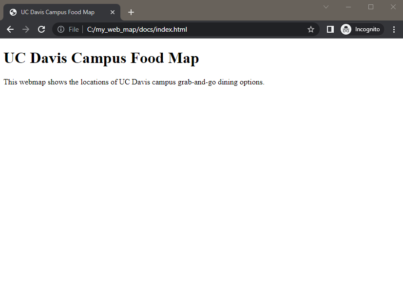

# Build a Webpage


The first step in building a web map is to make a basic webpage to house our map. It doesn't need to be elaborate to get started, but we do need to understand some concepts.

## Intro to HTML

HTML stands for "hypertext markup language". If you've ever used R Markdown or GitHub Markdown or worked in a Jupiter Notebook, you'll notice some similarities, but probably more differences.

The key thing to understand about HTML is that every element (text, code, images, etc.) you put into your code needs to be labeled to tell the web browser how to render that element.  We label the elements with a **tag**. We label the start of an element with an **opening tag**, such as `<p>` to start a paragraph, and end it with a **closing tag**, such as `</p>`.  Some tags are special and don't need to be closed, such as a line break `<br>`, but those are rare.

For example:

```
<h1>This is a heading</h1>
<p>This is text in a paragraph.</p>
```

There are tags for many types of elements. W3Schools lists them alphabetically in their [HTML Element Reference](https://www.w3schools.com/tags/default.asp).  We'll learn a few of the common tags as we build our webpage.


## Start Building your Webpage

Open the `index.html` file (it's in the 'docs' folder) in a text editor either by starting your text editor program and loading the index.html file, or right clicking on the file in your file browser, choosing "open with" from the menu, and then choosing the editor program you want to use. Using a text editor with syntax highlighting can be helpful, but isn't mandatory. Since we just created it, the file is blank. We'll add some code to get started.

The first, we need to indicate that our text file contains HTML, and then place opening and closing tags to indicate which part of the document contains HTML. We'll eventually write our webpage code between those HTML tags.

```
<!DOCTYPE html>
<html>

</html>
```

Open your index.html file in a web browser such as Chrome or Firefox. Double clicking on the file in your file explorer will open it in your default browser. Yes, it's ok that we have the same file open in two programs because the browser just renders the file and you can't edit it from here.


We've made a blank webpage! Now, let's add something more interesting to it.

The beginning of the HTML document is where you normally place the parameters and settings that make the webpage work.  We'll add a section called **head** to our page to contain some of these parameters. Inside of the *head* section, we'll indicate the title of our webpage, wrapped in `<title>` tags. This puts the name of the webpage  in the tab at the top of the browser.

**NOTE:** We'll highlight new text and code that we add to the code sections in yellow to draw attention to what's changed.

```
<!DOCTYPE html>
<html>

<highlight><head>
<title>UC Davis Campus Food Map</title>
</head></highlight>

</html>
```

If you reload the `index.html` file in your web browser, you'll have a blank page with a tab called "UC Davis Campus Food Map".


The **body** section of a web page contains the code that appears on the actual web page. We'll add a *body* section and some information. Note that `<h1>` makes a heading and `<p>` makes a paragraph.

```
<html>

<head>
<title>UC Davis Campus Food Map</title>
</head>

<highlight><body>
<h1>UC Davis Campus Food Map</h1>
<p>This webmap shows the locations of UC Davis campus grab-and-go dining options.</p>
</body></highlight>

</html>
```

Reload your `index.html` document in your browser to see your new text. You have now written a short but very legitimate HTML webpage! We could certainly write more text, but for the sake of demonstration, we'll keep it short for now. In the next section, we'll build the code that makes our web map.



**CHECK YOUR WORK:** Compare your code with [example code up to this point in the workshop](https://github.com/ucdavisdatalab/workshop_web_maps/blob/main/example_code/end_of_sec_3.html).
