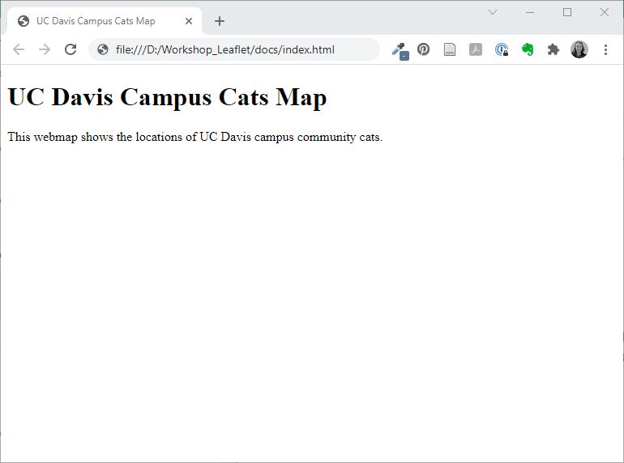

# Build a Webpage

The first step in building a web map is to make a basic webpage to house our map. It doesn't need to be elaborate to get started, but we do need to understand some concepts.

## Intro to HTML

HTML stands for "hypertext markup language". If you've ever used R Markdown or GitHub Markdown or worked in a Jupiter Notebook, you'll notice some similarities, but probably more differences.

The key thing to understand about HTML is that every element (text, code, images, etc.) you put into your code needs to be labeled to tell the web browser how to render that element.  We label the elements with a **tag**. We label the start of an element with an opening tag, such as `<p>` to start a paragraph, and end it with a closing tag, such as `</p>`.  Some tags are special and don't need to be closed, such as a line break `<br>`, but those are rare.

For example:

```
<h1>This is a heading</h1>
<p>This is text in a paragraph.</p>
```

There are tags for many types of elements. W3Schools lists them alphabetically in their [HTML Element Reference](https://www.w3schools.com/tags/default.asp).  We'll learn a few of the common tags as we build our webpage.


## Start Building your Webpage

Open the `index.html` file (it's in the 'docs' folder) in a text editor. Using a text editor with syntax highlighting can be helpful, but isn't mandatory. Since we just created it, the file is blank. We'll add some code to get started.

The first, we need to indicate that our text file contains HTML, and then place opening and closing tags to indicate which part of the document contains HTML. We'll write our webpage code between those HTML tags.

```
<!DOCTYPE html>
<html>

</html>
```

We've made a blank webpage! Now, let's add something more interesting to it.

The beginning of the HTML document is where you normally place the parameters and settings that make the webpage work.  We'll add a section called **head** to our page to contain some of these parameters. Inside of the *head* section, we'll indicate the title of our webpage, wrapped in `<title>` tags. This puts the name of the webpage  in the tab at the top of the browser.

```
<!DOCTYPE html>
<html>

<head>
<title>UC Davis Campus Cats Map</title>
</head>

</html>
```

If you open your `index.html` file in your web browser, you'll have a blank page with a tab called "UC Davis Campus Cats Map".

The **body** section of a web page contains the code that appears on the actual web page. We'll add a *body* section and some information. Note that `<h1>` makes a heading and `<p>` makes a paragraph.

```
<html>

<head>
<title>UC Davis Campus Cats Map</title>
</head>

<body>
<h1>UC Davis Campus Cats Map</h1>
<p>This webmap shows the locations of UC Davis campus community cats.</p>

</body>

</html>
```

Reload your `index.html` document in your browser to see your new text. You have now written a short but very legitimate HTML webpage! We could certainly write more text, but for the sake of demonstration, we'll keep it short for now. In the next section, we'll build the code that makes our web map.


