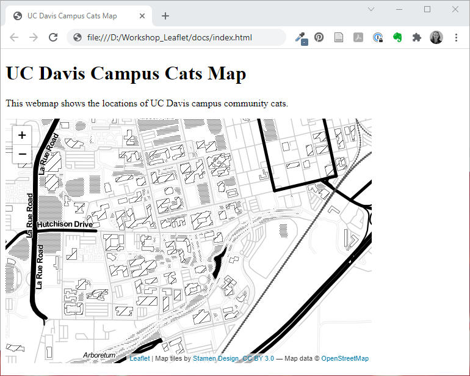
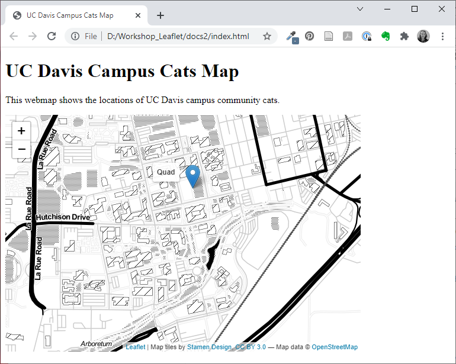
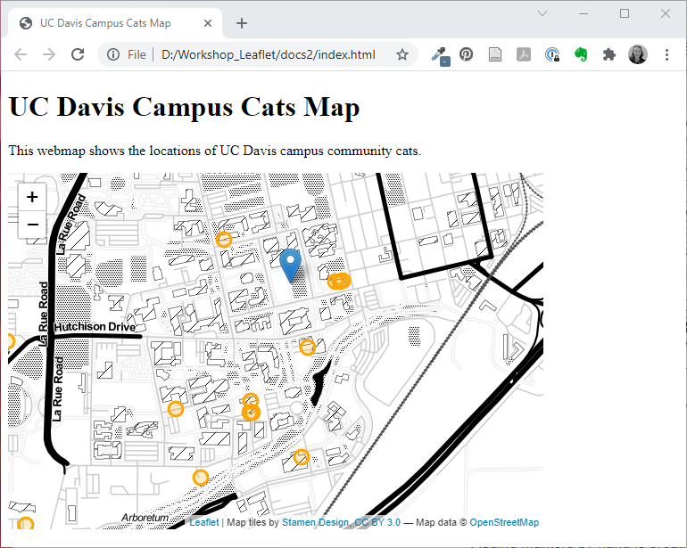
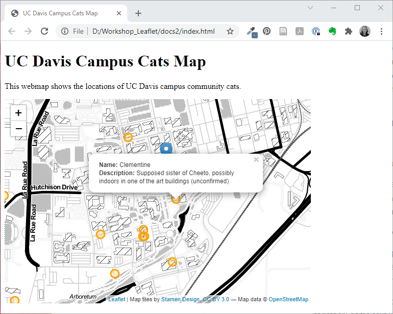

# Build a Leaflet Web Map

Now that we've made a basic webpage, we can add our web map.

## Prepare Your Page

### Load The External Files

In the **head** section of our webpage, we need to add some information that will tell our map how to appear (the CSS file) and where to find the Leaflet package (Leaflet JavaScript file).

CSS stands for Cascading Style Sheet. You can think of this as the parameters that set the way certain objects are displayed in a website. The pre-made file we'll load specifically styles the map elements made with Leaflet.

Loading the Leaflet JavaScript file enables our webpage to have access to the functions and tools in the Leaflet Library. For R or Python users, this is similar to loading packages or libraries in your code.  We could save a static version of this library in our website folders and point to that, or we can link to an online version of it, like we have done in the code below.

```
<!DOCTYPE html>
<html>

<head>
<title>UC Davis Campus Cats Map</title>

<highlight><!--Load the Leaflet CSS file -->
<link rel="stylesheet" href="https://unpkg.com/leaflet@1.7.1/dist/leaflet.css" integrity="sha512-xodZBNTC5n17Xt2atTPuE1HxjVMSvLVW9ocqUKLsCC5CXdbqCmblAshOMAS6/keqq/sMZMZ19scR4PsZChSR7A=="crossorigin=""/>

<!--Load the Leaflet JavaScript file -->
<script src="https://unpkg.com/leaflet@1.7.1/dist/leaflet.js" integrity="sha512-XQoYMqMTK8LvdxXYG3nZ448hOEQiglfqkJs1NOQV44cWnUrBc8PkAOcXy20w0vlaXaVUearIOBhiXZ5V3ynxwA=="crossorigin=""></script></highlight>
</head>

<body>
<h1>UC Davis Campus Cats Map</h1>
<p>This webmap shows the locations of UC Davis campus community cats.</p>

</body>

</html>
```

Note that in HTML, comments are written like this: `<!-- This is a comment -->`. Comments are information for a person writing or reading the code and don't render on the website.

The code we just added doesn't make any visible changes on our website so if you reload your web page, you won't notice anything new, but it should load. If it has an error or the text doesn't show up, you'll need to debug your code.

### Add a Map Div

A `<div>` element defines a section in your HTML document. Our web map needs its own `<div>`. We'll add one inside the `<body>` of the webpage.  Note that the `<div>` has an ID. This will let us create settings and code that apply to this specific `<div>`.  We can define the style of the `<div>` inside the tag (as we have done below) or we could do it in the `<head>` of the document in a `<style>` subsection, or in a separate CSS file.  There are many good reasons to choose any of these places. We're definiting the style inside the `<div>` tag to make it easier to see how it applies to this specific `<div>` and to keep the code for the map all in one place.

```
<!DOCTYPE html>
<html>

<head>
<title>UC Davis Campus Cats Map</title>

<!--Load the Leaflet CSS file -->
<link rel="stylesheet" href="https://unpkg.com/leaflet@1.7.1/dist/leaflet.css" integrity="sha512-xodZBNTC5n17Xt2atTPuE1HxjVMSvLVW9ocqUKLsCC5CXdbqCmblAshOMAS6/keqq/sMZMZ19scR4PsZChSR7A=="crossorigin=""/>

<!--Load the Leaflet JavaScript file -->
<script src="https://unpkg.com/leaflet@1.7.1/dist/leaflet.js" integrity="sha512-XQoYMqMTK8LvdxXYG3nZ448hOEQiglfqkJs1NOQV44cWnUrBc8PkAOcXy20w0vlaXaVUearIOBhiXZ5V3ynxwA=="crossorigin=""></script>
</head>

<body>
<h1>UC Davis Campus Cats Map</h1>
<p>This webmap shows the locations of UC Davis campus community cats.</p>

<highlight><div id="mapid" style="width: 600px; height: 400px;"></div></highlight>

</body>

</html>
```

If you reload your `index.html` file in your browser, you shouldn't notice any difference. If the page doesn't load, however, you'll need to troubleshoot your code. Make sure your tags open and close in the right order.

### Add a Script Section

Finally, we need to add a section to our code to hold the Leaflet JavaScript code we will write to make our map.  Just below your map `<div>` (and inside the **body** section), add open and closed `<script>` tags.

```
<!DOCTYPE html>
<html>

<head>
<title>UC Davis Campus Cats Map</title>

<!--Load the Leaflet CSS file -->
<link rel="stylesheet" href="https://unpkg.com/leaflet@1.7.1/dist/leaflet.css" integrity="sha512-xodZBNTC5n17Xt2atTPuE1HxjVMSvLVW9ocqUKLsCC5CXdbqCmblAshOMAS6/keqq/sMZMZ19scR4PsZChSR7A=="crossorigin=""/>

<!--Load the Leaflet JavaScript file -->
<script src="https://unpkg.com/leaflet@1.7.1/dist/leaflet.js" integrity="sha512-XQoYMqMTK8LvdxXYG3nZ448hOEQiglfqkJs1NOQV44cWnUrBc8PkAOcXy20w0vlaXaVUearIOBhiXZ5V3ynxwA=="crossorigin=""></script>
</head>

<body>
<h1>UC Davis Campus Cats Map</h1>
<p>This webmap shows the locations of UC Davis campus community cats.</p>

<div id="mapid" style="width: 600px; height: 400px;"></div>

<highlight><script>

</script></highlight>

</body>

</html>
```

## Add A Map

Now we're ready to add a map. We'll make a simple one to start and add more data later.

Inside the `<script>` section, we'll now be writing javascript. `//` is how you indicate a comment in JavaScript.  Outside of this section, you'll be writing HTML. It can get confusing sometimes, so have patience with yourself.

First, we'll create an empty map in our mapid `<div>`, then we'll load Stamen's Toner tile service to use as a background layer. The limited color palette of the Toner tile service will make it easier to see the data we'll be loading later.

A tile service is a pre-built background layer that is available at various geographic scales.  The data is stored on a server and we can request the data show up in our map. Some of these are free and open. Other require registration or charge a fee. Stamen has several free (and beautiful) tile services that we can use.

**Note:** from now on, we'll be working in the `<script>` section, so the code will just show this section to avoid clutter and focus on what's changing in the code.

```
<script>

	<highlight>//add an empty map called "catmap" to the page in the mapid div
	var catmap = L.map('mapid', {
		center: [38.538592, -121.75],
		zoom: 15
		});

	//add the base map = Stamen Toner tile layer
	var Stamen_Toner = L.tileLayer('https://stamen-tiles-{s}.a.ssl.fastly.net/toner/{z}/{x}/{y}.{ext}', {
		attribution: 'Map tiles by <a href="http://stamen.com">Stamen Design</a>, <a href="http://creativecommons.org/licenses/by/3.0">CC BY 3.0</a> &mdash; Map data &copy; <a href="http://www.openstreetmap.org/copyright">OpenStreetMap</a>',
		subdomains: 'abcd',
		minZoom: 0,
		maxZoom: 20,
		ext: 'png'
		});
		catmap.addLayer(Stamen_Toner);</highlight>

</script>
```

Your web page should now have a map with Stamen's Toner tile layer. It should look something like this:



We'll add some of our own data to the map next.

### Add a Marker

Let's add a marker so we can find the Quad. The marker will be a blue inverted teardrop that will have a tooltip that says "Quad" when you hover over it.  At the end of your script section, add:

```
	<highlight>//add a marker for the Quad with a tooltip
			//Quad: 38.541162, -121.749371
	var marker = new L.marker([38.541112, -121.749350], {
		opacity: 1.0   //teardrop marker opacity may be set to zero
		}); 			
		marker.bindTooltip("<b>Quad<b>", {	});
		marker.addTo(catmap);</highlight>
		
</script>
```
You now have an interactive map with one marker!



Notice the order of the code: we first define the marker, then add the tooltip to the marker, and finally we have to add the marker to the map. Defining, adding specifications, then adding an item to the map is a pretty common workflow in Leaflet.

## Use External Data

Adding markers by hand is great, but what if we have a lot of data? Or what if our data is more complex than a few points to add? What if we want to prepare our data in a GIS or with a script ahead of time? If any of these situations apply to the work we want to do, we probably want to load data from a data file, not writing it out in the code.

There are many methods to load an external data file in Leaflet. We'll look at just one here, but there are ways to work with any of the common file types. Here, we'll use data in geoJSON format.

### About GeoJSON

GeoJSON is a spatial data format based on the JSON format. Both JSON and GeoJSON are open standard file formats that text-based (not binary). They store data as attribute-value pairs, such as `"Name": "Bob"` in our example below. You might think of this as the files storing the column name and the value for that column for a row in the table. Because they are text-based, they are human-readable (however, depending on the complexity of the data, you may not want to try to read it in a text editor). Another advantage of using a text-based format is that it can easily be stored in online version control systems like GitHub, as long as a file size isn't too big. This is a nice feature if you want to host your webmap on [GitHub Pages](https://pages.github.com/).

Any of the major GIS tools or programming languages can convert vector data to GeoJSON format.

The header and first line of our Campus Cats data looks something like this in GeoJSON (we removed the link URLs and added white space and indents for readability):

```
"type": "FeatureCollection",
"name": "campus_cats",
"crs": { "type": "name", "properties": { "name": "urn:ogc:def:crs:OGC:1.3:CRS84" } },
"bbox": [ -121.7734392, 38.5320672, 0, -121.746784, 38.5435618, 0 ],                                                               

"features": [
	{ 
	"type": "Feature", 
	"properties": { 
		"Name": "Bob", 
		"description": 
			"
			<br>
			<br>
			Bob is new to campus during the summer of 2020. The sex of Bob is unknown, named for their appearance - they look like a bobcat! Bob is cared for by two staff members in Voorhies. ", 
		"gx_media_links": "(URL goes here)", 
		"details": "Bob is new to campus during the summer of 2020. The sex of Bob is unknown, named for their appearance - they look like a bobcat! Bob is cared for by two staff members in Voorhies." }, 
	"bbox": [ -121.7471273, 38.5412044, 0.0, -121.7471273, 38.5412044, 0.0 ], 
	"geometry": { "type": "Point", "coordinates": [ -121.7471273, 38.5412044, 0.0 ] } 
	}

```

### Formatting the Data

For the sake of time in this workshop, we've already formatted the data for you, but let's talk about what we did.

Leaflet can't read GeoJSON directly, but we can turn the data file into a javascript (.js) file that Leaflet can understand. All we have to do is open the .geojson file in a text editor, add `var varable-name = {` at the beginning of the file, and `}` at the end of the file (we're "wrapping" the data in a variable declaration). Then we save the file with a .js extension (because what we've actually done is written a small JavaScript file).  We now have a javascript file that reads data from the GeoJSON text and creates a new variable containing our data.

**We've done this for you** to create the `campus_cats.js` file, declaring our variable as `campus_cats`.  You can see the GeoJSON structure and the variable declaration if you open the file in a text editor.

### Read the Data

To read the data into our webpage, we need to add another short script section, just above the one we've been working in that calls our `campus_cats.js` data file.

```
<body>
<h1>UC Davis Campus Cats Map</h1>
<p>This webmap shows the locations of UC Davis campus community cats.</p>

<div id="mapid" style="width: 600px; height: 400px;"></div>

<highlight><script src="campus_cats.js" type="text/javascript"></script></highlight>

<script>
```

Now the data in this file will be available to load into our map.

**NOTE:** You could put this script in the `<head>` of the document where we loaded the Leaflet and CSS scipts. I like to keep all the map code together for teaching purposes (less scrolling around). Both are valid and work the same.

### Add Data to the Map

This is the moment you've been waiting for! We'll add data from our external data file to the map.

Add this code to the bottom of your long script section (below where we made our marker for the Quad and above the closing `</script>` tag):

```
	<highlight>//add cat points from the GeoJSON (campus_cats.js) file

	var catpoints = L.geoJSON(campus_cats, {  
		pointToLayer: function(feature, latlng){  
			return L.circleMarker(latlng, {color: 'orange', radius: 8});
		}
	}).addTo(catmap);</highlight>
	
</script>
```
We now have many orange circles for our cats (and one for the quad that we added earlier)!



What does this code do though?

First, we create a variable called *catpoints* using the geojson data which we named *campus_cats* inside the .js file. Then we create a function called `pointToLayer` that uses the parameters *feature* (each row in the data) and *latlng* (the geometry) from the geojson data. We make a *circleMarker* using the *latlng* variable for the position, and use the style options between the {}s to style the marker the way we want it. In this case, it's orange and has a radius of 8 (which is a little smaller than the default). Finally, we add the entire set of markers we built to the map (remember that we called our div that holds our map *catmap*).

## Add a popup

It would be nice to have some information available for each marker. Let's make a popup that tells us about each cat.  We'll start with a text popup and gradually add more to it.

We made our markers for our point locations by iterating over the list of features in our dataset and making a marker for each of them.  We can add a function to the one we already have so that once the markers get made, each will get a popup.

We'll modify our code that adds our points to look like this:

```
	//add cat points from the GeoJSON (campus_cats.js) file

	var catpoints = L.geoJSON(campus_cats, {  
		pointToLayer: function(feature, latlng){  
			return L.circleMarker(latlng, {color: 'orange', radius: 8});
		}<highlight>,
		onEachFeature: function(feature, layer){
			layer.bindPopup("This is a popup!");
		}</highlight>
	}).addTo(catmap);
```


What did we do? After the `pointToLayer` function, we added a new created a new function called `OnEachFeature` that uses the feature (each row of the data) and the layer information. For each feature, we have it bind a popup to our layer (named *catpoints*) and put the text that is in the parentheses into the popup. For now, all of our popups will say "This is a popup!". We'll build on that next.

### Customize Popup Text with Data

This is progress! We have a map with points and popups that contain placeholder text. Let's use the attribute data from our *catpoints* layer to add the name of each cat to the popup.

Instead of the "This is a popup!" text, we can use the attribute data from our catpoints data. Replace the current "This is a popup!" text with: `feature.properties.Name` (with no quotes around it). As we loop through each row of our data, the code will add each cat's name to the popup.

```
	//add cat points from the GeoJSON (campus_cats.js) file

	var catpoints = L.geoJSON(campus_cats, {  
		pointToLayer: function(feature, latlng){  
			return L.circleMarker(latlng, {color: 'orange', radius: 8});
		},
		onEachFeature: function(feature, layer){
			layer.bindPopup(<highlight>feature.properties.Name</highlight>);
		}
	}).addTo(catmap);
```


What if we want to give the popup more context?

The text for the popup can be plain text, but we can also use HTML to style the text like a very small webpage. (If your head is starting to spin from switching languages... HTML page containing JavaScript containing HTML... this is normal.) We'll start small and build up to something more complex.

Maybe we want to indicate that the text in the popup is the name of the cat.  We can concatenate (paste together) some text with HTML styling with our code to get the cat names: `"<b>Name: </b>" + feature.properties.Name`

```
	//add cat points from the GeoJSON (campus_cats.js) file

	var catpoints = L.geoJSON(campus_cats, {  
		pointToLayer: function(feature, latlng){  
			return L.circleMarker(latlng, {color: 'orange', radius: 8});
		},
		onEachFeature: function(feature, layer){
			layer.bindPopup(<highlight>"<b>Name: </b>" + feature.properties.Name</highlight>);
		}
	}).addTo(catmap);
```

Our popups are starting to be much more useful!


Ready to get a little more complex? Let's add a description of the cat.  We can use `<br>` to create a line break and put text onto a new line: `"<b>Name: </b>" + feature.properties.Name + "<br><b>Description: </b>"+ feature.properties.details`  This gets harder to read the longer it gets, so sometimes it helps to write the HTML pieces on separate lines, and once you're ready to run it, put all the text onto one line. The text portion of our popup text needs to be wrapped in quotation marks but the calls for the data should not be.

```
	//add cat points from the GeoJSON (campus_cats.js) file

	var catpoints = L.geoJSON(campus_cats, {  
		pointToLayer: function(feature, latlng){  
			return L.circleMarker(latlng, {color: 'orange', radius: 8});
		},
		onEachFeature: function(feature, layer){
			layer.bindPopup("<b>Name: </b>" + feature.properties.Name <highlight>+ "<br><b>Description: </b>"+ feature.properties.details</highlight>);
		}
	}).addTo(catmap);
```



In our data, we have a column that has a link to a picture of each cat. Let's put the cat's picture at the top of the popup. The `` tag will add an image to our popup. `"<br><b>Name: </b>" + feature.properties.Name + "<br><b>Description: </b>"+ feature.properties.details`

Here's what the section of our code that adds the catpoints marker should now look like:

```
	//add cat points from the GeoJSON (campus_cats.js) file

	var catpoints = L.geoJSON(campus_cats, {  
		pointToLayer: function(feature, latlng){  
			return L.circleMarker(latlng, {color: 'orange', radius: 8});
		},
		onEachFeature: function(feature, layer){
			layer.bindPopup(
				"<highlight><br></highlight><b>Name: </b>" + feature.properties.Name + "<br><b>Description: </b>"+ feature.properties.details);
		}
	}).addTo(catmap);
```

And here is our web map:


## Put Your Web Page online
There are many options to put your web page online so others can see and interact with it. At the heart of the task is moving your *docs* folder to an online server and having some way to host the website. One option that is free of cost and well-documented is to use [GitHub Pages](https://pages.github.com/) (see the instructions for a "project site").
