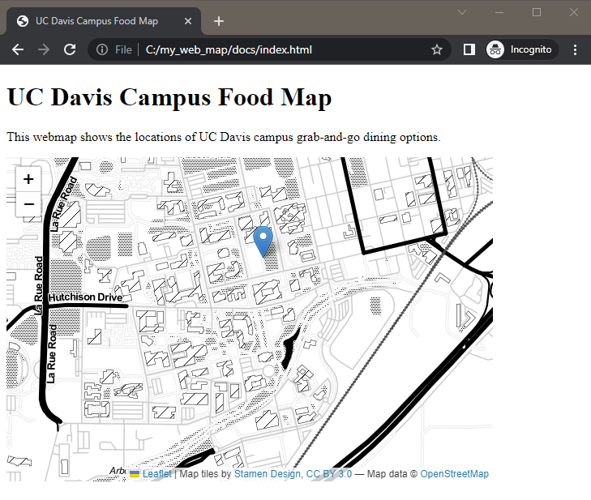

# Add a Map

**START FROM HERE:** You can keep working on your code from the previous section, or use the [example code up to this point in the workshop](https://github.com/ucdavisdatalab/workshop_web_maps/blob/main/example_code/end_of_sec_4.html).

Now that we've prepared our webpage we can add our web map.

## Add A Map

Now we're ready to add a map. We'll make a simple one to start and add more data later.

Inside the `<script>` section, we'll now be writing javascript. `//` is how you indicate a comment in JavaScript.  Outside of this section, you'll be writing HTML. It can get confusing sometimes, so have patience with yourself.

First, we'll create an empty map in our mapid `<div>`, then we'll load Stamen's Toner tile service to use as a background layer. The limited color palette of the Toner tile service will make it easier to see the data we'll be loading later.

A tile service is a pre-built background layer that is available at various geographic scales.  The data is stored on a server and we can request the data show up in our map. Some of these are free and open. Other require registration or charge a fee. Stamen has several free (and beautiful) tile services that we can use.

**Note:** from now on, we'll be working in the `<script>` section, so the code will just show this section to avoid clutter and focus on what's changing in the code.

```
<script>

	<highlight>
	//add an empty map called "foodmap" to the page in the mapid div
	var foodmap = L.map('mapid', {
		center: [38.538592, -121.75],
		zoom: 15
		});

	//add the base map = Stamen Toner tile layer
	var Stamen_Toner = L.tileLayer('https://stamen-tiles-{s}.a.ssl.fastly.net/toner/{z}/{x}/{y}.{ext}', {
		attribution: 'Map tiles by <a href="http://stamen.com">Stamen Design</a>, <a href="http://creativecommons.org/licenses/by/3.0">CC BY 3.0</a> &mdash; Map data &copy; <a href="http://www.openstreetmap.org/copyright">OpenStreetMap</a>',
		subdomains: 'abcd',
		minZoom: 0,
		maxZoom: 20,
		ext: 'png'
		});
		foodmap.addLayer(Stamen_Toner);
	</highlight>

</script>
```

Your web page should now have a map with Stamen's Toner tile layer. It should look something like this:


We'll add some of our own data to the map next.

## Add a Marker

Let's add a marker so we can find the Quad. The marker will be a blue inverted teardrop that will have a tooltip that says "Quad" when you hover over it.  At the end of your script section, add:

```
	<highlight>
	//add a marker for the Quad with a tooltip
			//Quad coordinates: 38.541162, -121.749371
	var marker = new L.marker([38.541112, -121.749350], {
		opacity: 1.0   //teardrop marker opacity may be set to zero
		}); 			
		marker.bindTooltip("<b>Quad</b>", {	});
		marker.addTo(foodmap);
	</highlight>
		
</script>
```
You now have an interactive map with one marker!



Notice the order of the code: we first define the marker, then add the tooltip to the marker, and finally we have to add the marker to the map. Defining, adding specifications, then adding an item to the map is a pretty common workflow in Leaflet.

**CHECK YOUR WORK:** Compare your code with [example code up to this point in the workshop](https://github.com/ucdavisdatalab/workshop_web_maps/blob/main/example_code/end_of_sec_5.html).
